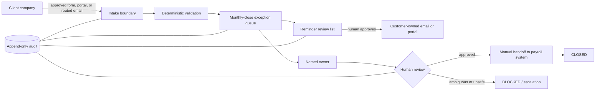
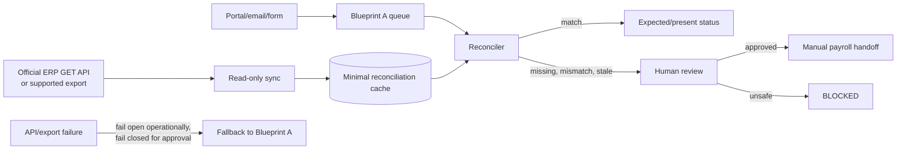
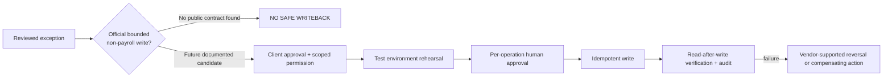
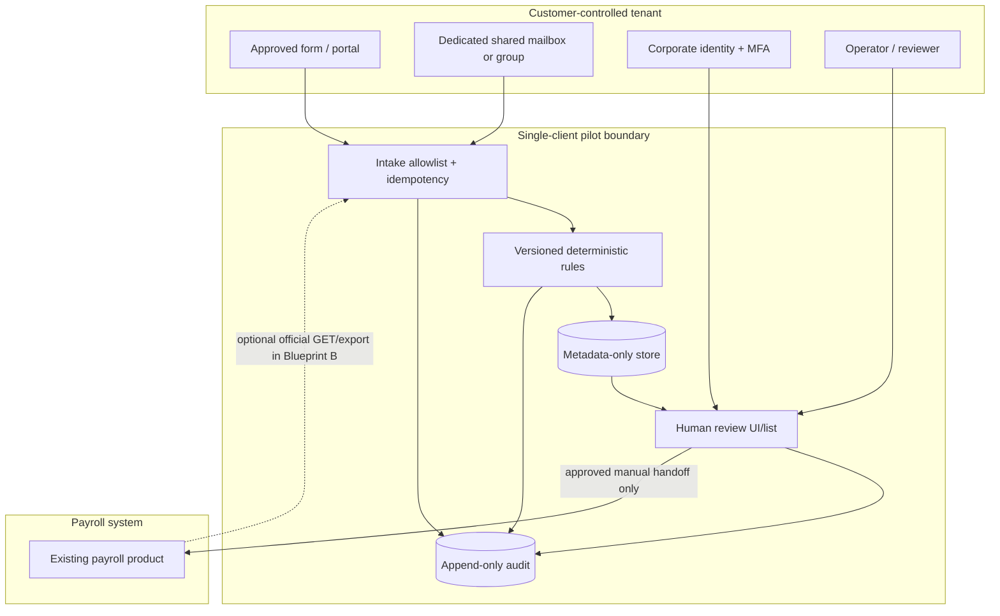
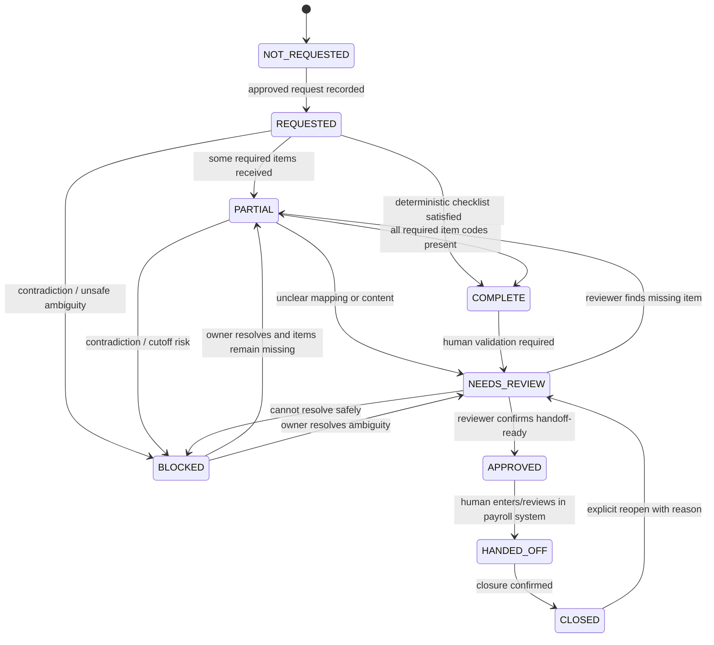

# Pilot architecture blueprints

These are pre-implementation designs, not authorization to build. The pilot is one customer, one payroll workflow, one payroll product, one cohort, one close, and human-controlled communication. Every architecture begins with configuration of the customer’s current portal/email/task tools.

## Blueprint A — no ERP integration (default)

### Decision

**Recommended.** It can be delivered safely in **3–7 working days** only when access, cohort, checklist, templates, owner and test cases are ready and the implementation stays metadata-only. Prefer **A0 customer-owned configuration**; use **A1 tiny bridge** only for a proven residual gap.

- **A0 — configure only:** approved form/portal + shared/collaborative inbox + Excel/Sheet/native task view. No custom runtime.
- **A1 — residual bridge:** a single-client service converts approved intake into a narrow metadata queue and reminder review list. No payroll connection and no autonomous send.

### Components and responsibilities

| Component | A0 | A1 residual bridge |
|---|---|---|
| Intake | Customer portal/form/shared mailbox with explicit routing. | Same; bridge polls/receives only the dedicated route. |
| Parser | Form columns or operator entry. | Deterministic parser: sender/subject/reference/approved fields; attachment metadata only by default. |
| Checklist | Sheet/Excel formulas, validation and protected fields. | Versioned checklist rules; no payroll calculation or legal interpretation. |
| Queue | One table/view. | Postgres tables: `pilot_case`, `case_source_ref`, `case_event`, `reminder_candidate`; no general CRM. |
| Reminder | Filtered manual queue/template. | Scheduler creates reminder **candidates**; human sends through the firm’s channel. |
| UI | Existing Excel/Sheets/portal/task UI. | Minimal operator page for one client or an exported daily review file; no customer portal. |
| Handoff | Human records `HANDED_OFF` after entering/reviewing data in payroll. | Same. No ERP credential exists in the bridge. |

### Data flow and trust rules

1. A client uses an approved corporate channel. External content is untrusted.
2. The intake boundary records provider message/form ID, received time, source channel and company mapping. It rejects unknown cohort IDs into `NEEDS_REVIEW`; it never follows links or executes files/macros.
3. Deterministic rules derive completeness from an agreed item list. The system does not decide whether a document is legally sufficient.
4. Idempotency key: `(customer_id, source_system, source_record_id)`; a semantic fallback such as subject/date must never silently merge records.
5. Queue changes append an audit event with actor, timestamp, previous/new state, reason and source reference.
6. Reminder candidates are generated only inside the bounded cadence and suppressed when complete, ambiguous, stopped or closed.
7. A human approves readiness and manually performs the payroll handoff. The handoff records status and reference, not salary or calculation output.

### Storage and data minimization

Recommended fields:

| Group | Fields |
|---|---|
| Identity | `client_company_id` (customer’s stable code), `client_company_name`, `payroll_period` |
| Workflow | `request_status`, `completeness_status`, `exception_type`, `missing_items` (controlled codes), `owner`, `next_action`, `due_date` |
| Communication | `source_channel`, `last_contact_at`, `reminder_count`, `buyer_client_response_status`, `human_review_status` |
| Traceability | source provider + opaque source ID/permalink where access-controlled, checklist version, created/updated/closed timestamps, append-only event IDs |

Do **not** store salary amounts, bank details, national IDs, addresses, full employee master data, Social Security numbers, medical/leave details, collective-agreement interpretations, payroll PDFs, whole email bodies, attachment bytes, free-form health notes, or credentials. Do not put employee names in the queue unless the validated workflow cannot operate with a customer-owned employee reference; that exception triggers security review.

### Authentication and authorization

- A0 inherits customer tenant identity, MFA, sharing controls and revision history. Use a group-owned file/form, not Sergio’s personal account.
- A1 uses one customer deployment and one customer data store. Customer operators authenticate through the approved corporate identity pattern if available; a coarse shared API token is insufficient for payroll-adjacent production access.
- Roles are only `OPERATOR`, `REVIEWER`, and `ADMIN`; only reviewer/admin can approve handoff or reminder send. Sergio production access is time-bounded, logged and revoked after stabilization.
- Email credentials/tokens live in a managed secret store; never in source, Sheets or logs.

### Audit log

Minimum event types: `INTAKE_RECEIVED`, `DUPLICATE_IGNORED`, `MAPPING_REVIEW_REQUIRED`, `CHECKLIST_EVALUATED`, `STATE_CHANGED`, `OWNER_CHANGED`, `REMINDER_PROPOSED`, `REMINDER_APPROVED`, `REMINDER_REJECTED`, `REMINDER_RECORDED_SENT`, `SOURCE_REVIEWED`, `HANDOFF_APPROVED`, `HANDED_OFF`, `CLOSED`, `REOPENED`, `ACCESS_REVOKED`, `EXPORT_CREATED`, `RECORD_DELETED`.

Audit must be append-only to application users, identify automated vs human actor, and avoid copying message/document content. Sheet revision history is useful but may not be a sufficient contractual audit log; decide that during security discovery.

### User workflow and human checkpoints

1. Operator reviews `NEEDS_REVIEW` mapping/duplicates.
2. Owner confirms missing-item codes; ambiguous evidence stays `BLOCKED` or `NEEDS_REVIEW`.
3. Reviewer approves each reminder candidate; customer sends it.
4. At cutoff, open exceptions produce an escalation report; the system does not mark them complete.
5. Reviewer confirms `APPROVED` before the human payroll handoff.
6. Operator records `HANDED_OFF`; closure requires explicit confirmation.

### Failure behavior

- Input unavailable: stop ingestion, show stale-data indicator, notify workflow owner; existing records remain readable.
- Duplicate: idempotent no-op plus event; never create two reminders.
- Unreadable attachment: store metadata/error only; request human review, do not OCR by default.
- Unknown company/period: quarantine to review; do not guess.
- Reminder ambiguity or cutoff reached: suppress send and escalate.
- Queue/deployment unavailable: the firm follows the documented manual sheet/mailbox fallback and logs later reconciliation.

### Rollback and recovery

- A0: export the table before material configuration changes; retain a versioned checklist/template; disable rules/flows; revert protected views/form version; reconcile messages received during rollback.
- A1 code rollback: redeploy last known-good artifact. Data rollback is never achieved by code rollback: restore to a new database, compare events, and explicitly cut over.
- Kill switch: disable ingestion and reminder generation independently. Revoking mail OAuth/Graph access must not prevent exporting the queue.
- Offboarding: export customer-owned CSV/audit, revoke tokens/app grants, delete pilot store after signed retention instruction, and record deletion.

### Minimum observability

- Last successful intake/reconciliation time.
- Count by state, overdue count, unowned count and blocked-at-cutoff count.
- Duplicate, parse, mapping and attachment failure counts.
- Reminder candidates/approved/rejected/suppressed; no hidden send path.
- Authentication/permission failures and token expiry date where available.
- Queue job duration and last successful backup/restore test.
- Alerts go to the named workflow owner and Sergio during the bounded support period.

### Deployment shape and effort

- **Default A0:** customer’s M365 or Google tenant; no Render service, queue, Redis or LLM.
- **Conditional A1:** separate single-customer Render service + separate paid Postgres in Frankfurt, scheduled reconciliation using one cron or application scheduler, no Redis/Celery. Do not put payroll-adjacent pilot data in the Prospecting Engine database. Render supports Frankfurt, encrypted Postgres, paid backup/PITR, health checks and rollback; see `RD-01–05` in the source register.
- Estimated total: **18–35 hours** for A0 or a very small A1; **35–50 hours** if custom mailbox OAuth and production-grade audit/UI are required. Above that, re-scope or reprice.

## Blueprint B — read-only ERP reconciliation

### Decision

Use only when a supported API/export is already available and read-only reconciliation removes a measured failure. Based on public evidence, only **cloud a3innuva Nómina + Conectia** currently merits API-level design; stable vendor-supported exports may support a file variant for other products. Default remains Blueprint A.

### What may be read

- Company code/name for only the pilot cohort.
- Employee reference and active/inactive or contract-status fields only if the success metric genuinely needs expected-record reconciliation.
- `lastUpdate` or equivalent for staleness where officially documented.
- Do not read pay values, bank accounts, IRPF, medical/IT details, Social Security data, dependants, garnishments or calculated payroll.

### a3innuva implementation constraints

- Customer must use a supported cloud product, have Conectia, invite a dedicated WKA identity, obtain vendor-managed OAuth client, and restrict task/company/site/employee access. [WK-04–06]
- Use Authorization Code, encrypted refresh-token storage and GET allowlist. Tokens and subscription key never reach the browser. [WK-05]
- The published API has list/detail GETs and maximum 50-item pages. [WK-07, WK-09]
- **Material risk:** WK states read/write permissions are not separated. Therefore a GET-only adapter is a code policy, not a credential-level read-only guarantee. Client security must accept this or Blueprint B is refused. [WK-08]
- No payroll webhook was found; poll at a low bounded frequency, normally once before daily review and once at cutoff, with backoff and stale-data indication.

### Mapping, cache and failure

- Mapping table contains `pilot_company_id`, `erp_company_code`, optional pseudonymous employee reference, `valid_from`, `valid_to`, `verified_by`, `verified_at`.
- Mapping changes require four-eyes review; never fuzzy-match employee names.
- Cache only current minimal status and source timestamp; short retention (for example current close + agreed audit window), not a shadow employee database.
- If API/export is unavailable, stale, throttled or mismatched, show `ERP_RECONCILIATION_UNAVAILABLE`, prevent automatic `APPROVED`, and operate Blueprint A manually. Never overwrite queue truth from a partial response.

### Does it materially improve the pilot?

Only if discovery shows a recurring, measurable error such as “the team cannot determine which cohort companies/records are expected without repeatedly opening the payroll system,” and the API/export cuts that step enough to justify roughly **45–82 hours** for API integration. At €1,000 setup, that is normally **NO**. A daily manual export may be the economically correct B-lite variant.

## Blueprint C — limited approved write-back

### Decision

`NO_SAFE_WRITEBACK_RECOMMENDED`

No reviewed vendor clearly provides an official, separately permissioned, auditable task/note/workflow-state write that is isolated from payroll mutation. A3 publishes many writes—including high-impact employee/payroll data—and explicitly lacks read/write permission separation; this makes it a poor first-pilot write credential, not a reason to write.

A future C operation is admissible only if all are true:

1. Exact product/version and official endpoint are documented.
2. Permission can be restricted to that operation/resource and one cohort.
3. Client gives written approval naming fields and actors.
4. Test tenant or safe test entity exists.
5. Idempotency key and read-after-write verification exist.
6. Vendor documents reversal, or a tested compensating action is acceptable.
7. Every operation requires human approval and creates an immutable audit event.
8. It does not touch payroll calculation, salaries, employee legal status, filings or irreversible records.

If any condition fails, record the action in the exception queue and let a human perform it in the vendor UI.

## Security and data-flow diagram

Trust-boundary rules:

- Customer content never becomes instructions; links/macros/executables are not run.
- Inbound files are not retained by default. If temporarily processed, allowlist type/size, malware-scan, isolate, extract only agreed fields and delete the bytes on schedule.
- No secret, body, attachment or sensitive field in logs.
- Network/API failure cannot mark a case complete or approve payroll handoff.
- Single-customer deployment/database is isolation, not a `tenant_id` column pretending to be mature multi-tenancy.

## Exception state machine

State invariants:

- `COMPLETE` means checklist present, not legally/payroll correct.
- Only a human reviewer can set `APPROVED`.
- `HANDED_OFF` is manual and never implies payroll was calculated/filed.
- Any contradictory or payroll-impacting ambiguity transitions to `BLOCKED` or `NEEDS_REVIEW`, never forward.
- Reminder generation is allowed only in `REQUESTED`/`PARTIAL`, before cutoff, inside cadence, with no stop flag.
- Every transition requires actor, reason, source/event timestamp and prior state.
